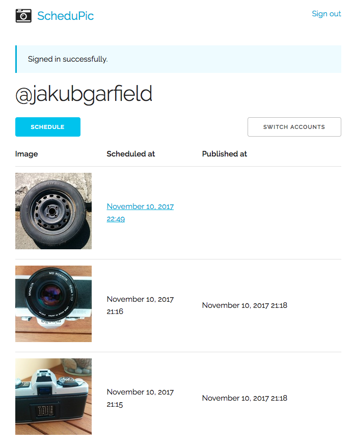
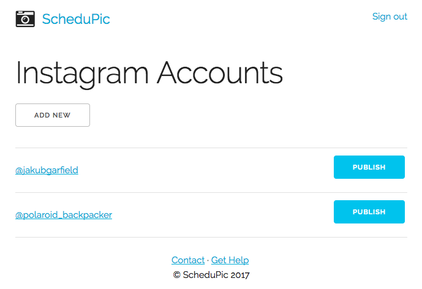

📷 ScheduPic is a tool used to ⏰ schedule and post your 🌁 photos to [Instagram](http://instagram.com/). Because who wouldn't like to do it from their phone at 3am in the morning if you happen to be in a different timezone than your target audience?

It's also the safest and fastest way to get [shadowbanned](https://later.com/blog/instagram-shadowban/) as Instagram has a set of rules to prevent external tools (including Chrome Dev Tools hack) to publish posts for you. And you are breaching their Terms of Service.

Oh well, at least I discovered it prior to building the tool. Oh wait a minute – I haven't.

## Screenshots

Dead simple queue view that totally makes sense. You can chuck a picture of an old camera (preferably SLR from 70' as they look very hipster, [TLRs](https://en.wikipedia.org/wiki/Twin-lens_reflex_camera) are a good choice as well as everything with [Hasselblad](http://www.hasselblad.com/) name on it. I wonder how many likes is the tyre gonna get though.

Yes, you can manage multiple accounts in a wonderfully beautiful way. You can have a [specialised account](https://www.instagram.com/polaroid_backpacker) for all your [lomo](https://en.wikipedia.org/wiki/Lomography) stuff. The more Russian your camera brand sounds the better.

## Features

* multiple Instagram account support
* totally safe (but not really) storage of Instagram credentials
* hashtags in caption
  * that get shadowbanned so they don't really work
  * but hey – your followers can see the post
* aspect ratio check

## Stack

* Ruby on Rails 5.1
* [Skeleton](getskeleton.com) – an awesome minimalist alternative to Bootstrap
* good ol' cron

Note the commits don't follow any good practices of being atomic and stuff. Imagine what a nightmare it'd be to maintain the code if it would happen to be a successful product. Good thing that it probably won't be.
